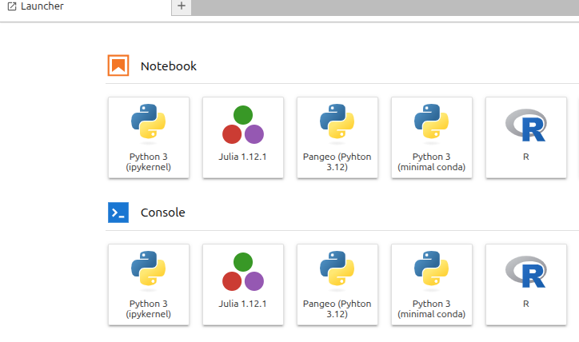

# GEO4990-notebooks 

All labs will be conducted directly in JupyterHub. The main advantage of this is that all the data we need are directly accessible through the web interface and the necessary post-processing and visualization packages we need are already available.

JupyterHub is a multi-user system that gives access to computational environments and ressources. All hard- and software you need is pre-installed, and you can find all the data you need here. After login, you can get access to the computing environment. You can use the terminal and other pre-installed software within this environment, e.g. python in our case. You also have storage within the computing environment, which is only accessable by you and the course administrators. Your home is visible on the left. It contains a folder `shared-clinfra-ns12127k` with GEO4990-notebooks with jupyter notebooks with model labs, and folders that contains intake catalogs data you will need for the assignments.

## Setup instructions for accessing Jupyterhub

You should have received an info email containing an invitation link. If not please request it from the course organizers.
- Follow the invitation link in the email message
- Log in with your University of Oslo Feide account
- Accept the policies and agree to become a member of the group GEO4990-2026
- Now go to GEO4990 Jupyterhub or copy-paste in your address bar: https://geo4990-2026.clinfra.sigma2.no
- Log in with your University of Oslo Feide account
- You should now be logged in to the JupyterHub in your web browser.
The JupyterLab Interface

By default, you will get the web-based user interface for Project Jupyter that is called JupyterLab.

### Menu Bar

The menu bar at the top of JupyterLab has top-level menus that expose actions available in JupyterLab with their keyboard shortcuts. The default menus are:

- `File`: actions related to files and directories
- `Edit`: actions related to editing documents and other activities
- `View`: actions that alter the appearance of JupyterLab
- `Run`: actions for running code in different activities such as notebooks and code consoles
- `Kernel`: actions for managing kernels, which are separate processes for running code
- `Tabs`: a list of the open documents and activities in the dock panel
- `Settings`: common settings and an advanced settings editor
- `Help`: a list of JupyterLab and kernel help links

### Left Sidebar

 - The left sidebar contains a number of commonly used tabs, such as a file browser, a list of running kernels and terminals, the command palette, and a list of tabs in the main work area:

If you hover your cursor over an icon of this left sidebar, short information is given on its functionality.

 - The most useful “stop button” icon allows you to see what is currently running on your server and you can click on “SHUT DOWN” to stop running notebooks, kernels, and terminals.

### Launcher

 - On your first server start you will have your Launcher open. 

To create a python notebook for our lab, choose `Pangeo (Python 3.12)` as your kernel. When opening new notebooks, you will also have to choose `Pangeo` all the necessary packages are in that environment. Alternatively, you can create a notebook with File>New>Notebook.

By default, your new notebook is named as “Untitled.ipynb”:

 - ipynb is the extension for any Jupyter notebook and you should make sure all your notebooks get this extension (otherwise it is not recognized as a Jupyter notebook)
 - you can rename your jupyter notebook with the tab “File –> Rename Notebook…” or right click on its name.
 - If the Launcher tab has been closed, you can start a new one in “File –> New Launcher”. You can also open a terminal etc.

**IMPORTANT**: Make sure that the correct kernel is chosen when you are trying to run a notebook:
You will get a module import errors if you try to use minimal or base unvironments/kernels. Chose labs.

## Folder structure, Lab Notebooks and Data Access

By default, you are in your home directory after logging into the JupyterHub. You can browse the folder structure on the left and get back to your home directory by clickling on the little folder in front of the current path.

The jupyter notebooks for this class are located in `shared-clinfra-ns12127k/GEO4990-notebooks`. This folder will become updated with your tasks and the templates for the labs throughout the semester. Please copy the notebooks from there into your home, e.g. create a folder 'lab01', a folder 'lab02'. You  have **only read access** in shared-clinfra-ns12127k/GEO4990-notebooks. So it's a good idea to first `copy` the notebook or `save as` it into your home. 

### Data

The model output we work with in this course is stored in:
 - `shared-clinfra-ns12127k` -> `/mnt/clinfra-ns12127k`,
 - `shared-clinfra-ns12127k-ns9034k-cmip6` -> `/mnt/clinfra-ns12127k-ns9034k-cmip6`, 
 - `shared-clinfra-ns12127k-ns9560k-datalake` -> `/mnt/clinfra-ns12127k-ns9560k-datalake`.
 - (right to the arrow is the absolute path)

 All NORESM (the Norwegian Earth System Model) data are in `shared-clinfra-ns12127k-ns9034k-cmip6/`.

 All other CMIP6 model output is in the other folders: `shared-clinfra-ns12127k-ns9560k-datalake/ESGF/CMIP6/`

Additionally, you can acess more data online through pangeo intake catalog: `https://storage.googleapis.com/cmip6/pangeo-cmip6.json`

#### Catalogs

**The best way to search and access data** is by using intake catalogs (see *Intro_UsingIntakeCatalogs.ipynb*)

The catalogs are in `shared-clinfra-ns12127k/catalogs` which makes navigating the different models, experiments, output variables etc. much easier than clicking through the folder structure. Check out the corresponding notebook of the first lab to learn how to use it and familiarize yourself with the folder structure and the attributes of the model output files.

**Warning**: We are handling large datasets and access them via the same ports, often many people at the same time. This can cause delays. Please use the data catalog for browsing instead of the file browser to the left in your JupyterLab. Please also report to the lab instructor when things take unreasonably long. This is important for us to know, and maybe the solution is fast, so don't waste your time!

## Start and stop your server

When you manage to successfully log into the Jupyterhub for the first time, your server will start automatically.

Later, you will be able to start/stop your server, click on Hub Control Panel: *File->Hub Control Panel* at the bottom of file menu.

A new tab in your browser will popup with the button “Stop My Server”.

To stop your server, click on “Stop My Server”
To start your server, click on “My Server”

> When you try to access Jupyterhub and get errors 400 or 502 --> it might be fixed by just deleting the site data in your browser (in Chrome that is  a button on the left of the address-bar if you use something else - google it. If you get error 403 --> you did not accept the invitation for the feide group.

**FOR MAC/WINDOWS users with non-US keyboard layouts:**

> Sometimes shortcuts for some of the default jupyterlab extensions (default for mac) are conflicting with your Norwegian mac keyboard layout.
>
>You can fix `[]` and `\` symbols that you get from Option+8,9,7 by doing the following:
>
> - In the lab menu at the top: *Settings->Settings Editor*. This will open an settings tab in your workspace.
> - Click on the `Plugin Manager` in the top-right of that tab near the `JSON Settings Editor`. This will open a new tab. Check the "I understand bla bla bla" box.
> - Filter by `inline`.
> - Turn off plugins for the `inline-completer` extension in the order they appear. 
> - Close `Plugin Manager` tab. 
> - Refresh the browser tab (if that is not enough, you need to restart your server *File->Hub Control->Panel->Stop My Server*).
> - Open `Plugin Manager` again. Filter by inline. Look if the boxes are unchecked. 
> - Try `[]` `\` in one of your notebook cells.